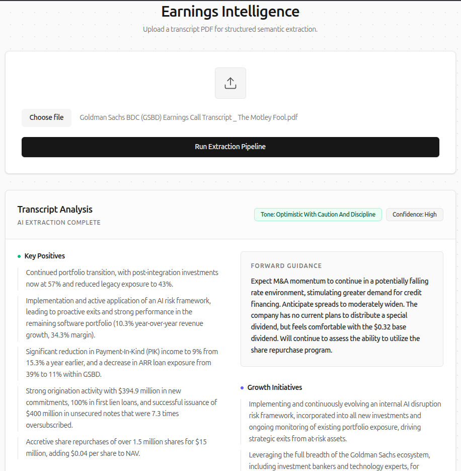

# 📈 Earnings Call AI Analyst

A full-stack, AI-powered financial research application designed to extract structured semantic data from unstructured earnings call transcripts. It processes PDF documents and utilizes Google's Gemini LLM with strict JSON schemas to generate a professional, hallucination-free dashboard of management sentiment, key concerns, and forward guidance.


**🚀 Live Demo:** [https://financial-research-tool-eight.vercel.app](https://financial-research-tool-eight.vercel.app)
**⚙️ API Status:** [https://financial-research-tool-dfhm.onrender.com/health](https://financial-research-tool-dfhm.onrender.com/health)

<p align="center">
  
</p>

---

## ✨ Key Features

- **🧠 Deterministic AI Extraction:** Utilizes Gemini's Structured Outputs (`SchemaType.OBJECT`) to strictly enforce JSON responses, preventing AI hallucinations and ensuring predictable data mapping for the frontend UI.
- **📄 Robust PDF Processing:** Parses raw text from PDF documents via ESM-compatible `pdf-extraction`, featuring auto-sanitization to strip whitespace and optimize LLM token usage.
- **🛡️ Graceful Failure Handling:** Detects scanned (image-based) PDFs lacking text layers and returns actionable `422 Unprocessable Entity` errors to the client rather than failing silently.
- **👔 Enterprise-Grade UI:** Designed with a high-contrast, institutional aesthetic using Tailwind CSS v4 and Vercel's Geist font, moving away from generic AI chat interfaces to mimic internal financial tooling.
- **🔒 Production Security:** API endpoints are protected by `express-rate-limit` (to prevent LLM quota abuse) and strictly configured CORS policies mapped to the production deployment.

---

## 🛠️ Tech Stack

| Layer | Technologies |
|---|---|
| **Frontend** | React 18, Vite, Tailwind CSS v4, Lucide React |
| **Backend** | Node.js, Express.js, TypeScript |
| **AI / LLM** | `@google/generative-ai` (Gemini 2.5 Flash) |
| **File Handling** | `multer` (In-memory storage), `pdf-extraction` |
| **Infrastructure** | Vercel (Client), Render (API) |

---

## 🏗️ Architecture & Judgment Calls

This project prioritizes **reliability and data structuring** over raw processing speed.

1. **Why Structured Outputs?** Standard prompt engineering often results in inconsistent markdown. By passing a strict JSON schema to the LLM, we guarantee the frontend receives exact keys (e.g., `capacity_utilization: "Not mentioned"`), allowing for a robust, map-able UI dashboard.
2. **Why In-Memory Multer?** For an MVP focused on text extraction, writing PDFs to a local disk or S3 bucket introduces unnecessary latency and cleanup overhead. Files are kept in a RAM buffer, parsed, and immediately garbage-collected.
3. **Monorepo Structure:** The project is divided into distinct `/client` and `/server` workspaces to enforce separation of concerns while allowing atomic commits across the full stack.

---

## 🚀 Getting Started

### Prerequisites

- Node.js (v18+)
- A free [Google AI Studio](https://aistudio.google.com/) API Key

### Installation

**1. Clone the repository**

```bash
git clone https://github.com/aqeell7/financial-research-tool.git
cd financial-research-tool
```

**2. Setup the Backend (API)**

```bash
cd server
npm install
```

Create a `.env` file in the `server` directory:

```env
PORT=5002
GEMINI_API_KEY=your_gemini_api_key_here
CLIENT_URL=http://localhost:5173
```

Start the backend development server:

```bash
npm run dev
```

**3. Setup the Frontend (Client)**

Open a new terminal window:

```bash
cd client
npm install
```

Create a `.env` file in the `client` directory:

```env
VITE_API_URL=http://localhost:5002/api/documents/upload
```

Start the frontend development server:

```bash
npm run dev
```

The application will be available at `http://localhost:5173`.

---

## 📂 Project Structure

```
financial-research-tool/
├── assets/                 # Readme assets & screenshots
├── client/                 # React Frontend Workspace
│   ├── src/
│   │   ├── App.tsx         # Main UI & State Management
│   │   ├── index.css       # Tailwind v4 & Geist Font imports
│   │   └── main.tsx
│   ├── postcss.config.mjs  # Tailwind compiler config
│   └── package.json
├── server/                 # Node/Express Backend Workspace
│   ├── src/
│   │   ├── routes/         # Express routers (document.routes.ts)
│   │   ├── services/       # Core logic (pdf.service.ts, ai.service.ts)
│   │   └── index.ts        # Server entry & Rate Limiting
│   ├── tsconfig.json
│   └── package.json
└── README.md
```

---

## 📝 API Endpoints

| Method | Endpoint | Description | Payload |
|---|---|---|---|
| `GET` | `/health` | API health check | None |
| `POST` | `/api/documents/upload` | Extracts text from PDF and returns AI analysis | `multipart/form-data` (`document`) |